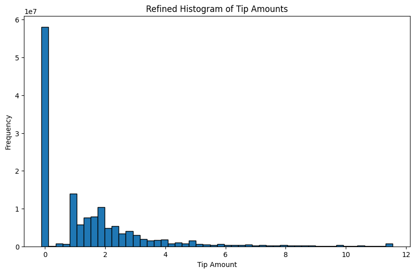
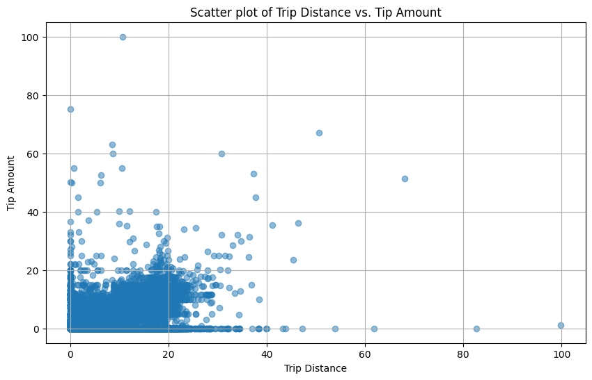
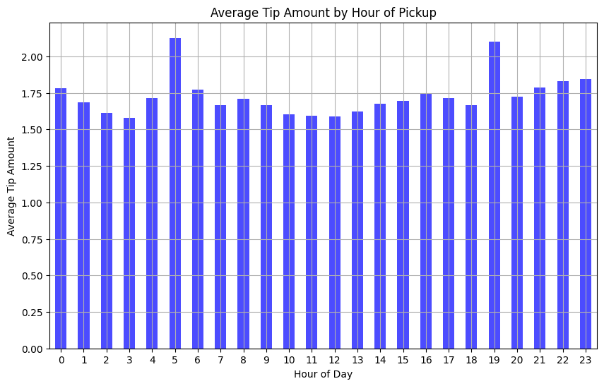
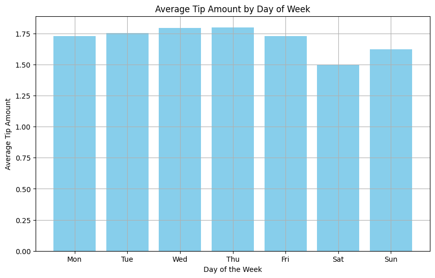
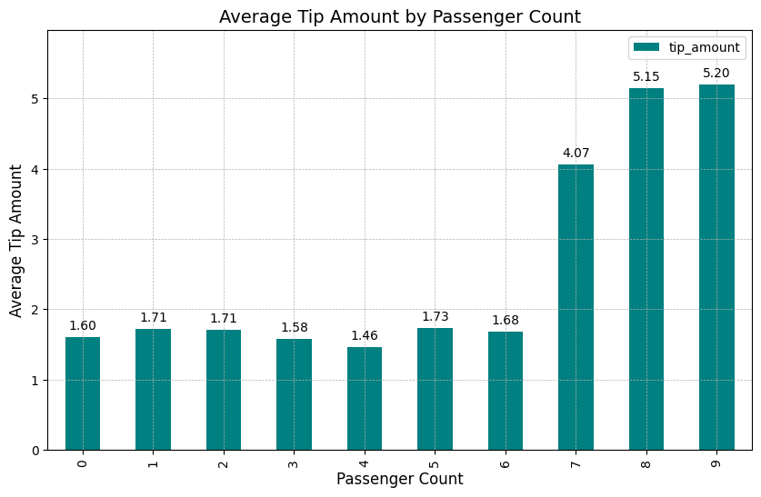
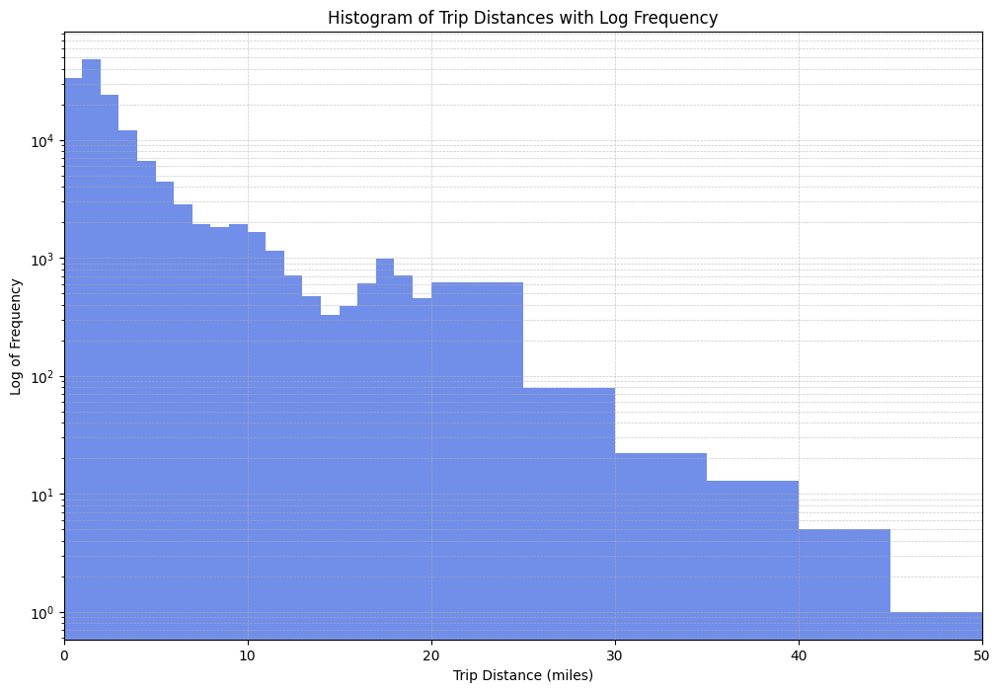

# a3-QIXIN-ACT

## 1. Exploratory Data Analysis

### Notebook with Code

+ Jupyter notebook with all necessary steps and annotations to ensure reproducibility: [Q1.ipynb](https://github.com/macs30123-s24/a3-QIXIN-ACT/blob/main/Q1.ipynb)

### Visualizations with Descriptions

#### Visualization1: Histogram of Tip Amounts

This histogram displays the distribution of tip amounts for NYC taxi trips. The majority of trips have a tip amount of zero, with a noticeable drop-off as the tip amount increases. The significant frequency of zero tips and the general trend toward lower tip amounts suggest that many passengers do not tip, and those who do typically leave modest tips.

#### Visualization2: Scatter plot of Trip Distance vs. Tip Amount

This scatter plot provides a detailed visualization of the relationship between trip distance and tip amount, revealing a dense cluster of trips under 20 miles with tips generally below $40. Notably, the plot shows a decline in higher tip amounts as trip distance increases, indicating that longer trips may not necessarily result in proportionally higher tips, which could be influenced by factors such as fare structure or passenger expectations.

#### Visualization3: Average Tip Amount by Hour of Pickup

This bar chart illustrates the average tip amount for NYC taxi trips by the hour of pickup. The data reveals that tips tend to be higher during early morning hours (around 5-6 AM) and late evening hours (around 7-8 PM). This pattern may be influenced by different passenger behaviors and trip purposes at these times, such as airport trips or evening outings, which could be important factors for predicting tip amounts.

#### Visualization4: Average Tip Amount by Day of Week

This bar chart shows the average tip amount received by NYC taxi drivers for each day of the week, highlighting a relatively consistent tipping pattern across the days with slight variations. Interestingly, the visualization indicates that people tend to tip slightly less during the weekend compared to weekdays.

#### Visualization5: Average Tip Amount by Passenger Count

This bar chart illustrates the average tip amount for NYC taxi trips based on the number of passengers. The data shows that trips with higher passenger counts, particularly those with 7 or more passengers, tend to receive significantly higher tips. This pattern suggests that larger groups are more likely to tip generously, which could be due to shared payment dynamics or group influence.

#### Visualization6: Histogram of Trip Distances

The majority of trips are concentrated in the shorter range, particularly under 10 miles, with the frequency sharply decreasing for longer distances. The log scale helps to illustrate the vast difference in the number of short versus long trips, highlighting the rarity of trips over 30 miles within the dataset - short trips are far more common than longer ones in the urban setting of New York City.

## 2. Implementing a Reproducible Machine Learning Pipeline

### (ab)

+ Jupyter notebook for Step1 - run locally to set up Spark EMR cluster: [Q23-Step1.ipynb](https://github.com/macs30123-s24/a3-QIXIN-ACT/blob/main/Q23-Step1.ipynb)

+ Jupyter notebook for Step2 - run on Spark EMR cluster: [Q23-Step2.ipynb](https://github.com/macs30123-s24/a3-QIXIN-ACT/blob/main/Q23-Step2.ipynb)

### (c)

When specifying a series of transformations in a Spark pipeline, the DataFrame is not immediately processed. Instead, Spark uses lazy evaluation to build a logical plan outlining the transformations. This plan is optimized but not executed until an action like fit, transform, or collect is called. Upon triggering an action, Spark's Catalyst optimizer converts the logical plan into a physical plan, which is then executed across the cluster.

This approach allows Spark to optimize the execution plan, ensuring efficient resource use. In contrast, Dask also employs lazy evaluation, building a task graph that is executed only when compute is called. Both systems delay execution for optimization, but Spark uses Catalyst for query optimization, while Dask relies on its task scheduler.

## 3. Finding Optimal Model Parameters

### Notebook with Code

+ Jupyter notebook - based on pipeline create in Q2 and need to be run on Spark EMR cluster: [Q23-Step2.ipynb](https://github.com/macs30123-s24/a3-QIXIN-ACT/blob/main/Q23-Step2.ipynb)

### Report and interpret the optimal model’s predictive performance

The model evaluation shows a Root Mean Squared Error (RMSE) of 1.967, indicating that predictions are, on average, about 1.967 units away from actual tip amounts. The model uses a regularization parameter (regParam) of 0.09 and an elastic net parameter (elasticNetParam) of 0.0, emphasizing L2 regularization.

Key predictors of tip amounts include pickup location and time of day. Trips from Newark (EWR) significantly increase tips, while early morning hours and weekends tend to decrease them. We can tell that hour_of_day and PUBorough might be the most relevant features for predicting tip amount because many of their one-hot encoded features have high coefficients among all features.

